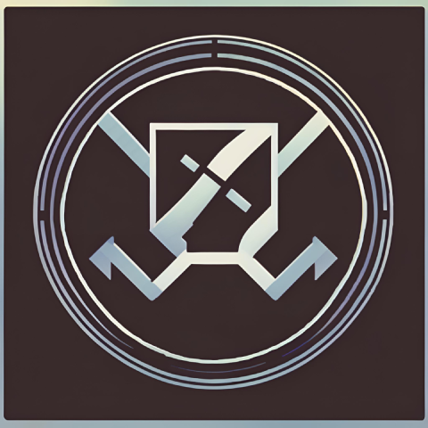

# AtEngine 🎮

Welcome to **AtEngine**, the ultimate ASCII-based game engine for creating retro and text-based games!



## DISCLAIMER

** This project is nowhere near being finished nor usable**

## Table of Contents

- [What-is-this?](##What-is-this?)
- [Features](##features)
- [Installation](##installation)
- [Usage](##usage)
- [Examples](##examples)
- [Documentation](##documentation)
- [Contributing](##contributing)
- [License](##license)


## What-is-this

Atengine is the retro game engine to be used for writing games for Hobbiest game console "Pixelite". Atengine uses unicode characters to render all graphics from UI elements to the games themselves! The Pixelite console is still being developed and this is just the first step in building it. A blog will be coming out soon with more information about the console.

### Why?

I decided to create atengine because I wanted to learn the Rust programming language with a fun project. I chose making a game engine because as a kid I always was curious on how these odd machines were able to run these games I would play. I was especially inspired by the Nintendo NES despite it's technical limitations. I decided to write the engine's graphical engine using Unicode rendering because it really captures the graphical limitations of the NES era of game consoles. 

### Unicode rendering

The graphical engine in atengine uses the unicode character "▄" which has foreground at the bottom and background at the top. This was picked because the resolution can be doubled due to being able to get two "pixels" with only one character. This decreased the render time per pixel and increased image quality over traditional ASCII characters. 

### Technical deatils and benchmarks

**Speed**
The speed of building frames on the console is very fast (45,000 fps on simple rotating triangle benchmark). This is due to the many hours spent on optimizing the Rust code used to render frames. However, in practice when blitting the pixels and displaying the actual graphics the engine can only handle up to around 10 fps. This is due to the technical limitations of printing text to a terminal which bottlenecks performance.  

**Color**
Atengine uses 24 bit color or (Truecolor) for an vibrant and sharp image. Options to reduce color depth will be added in future updates. Lower color depth may increase the speed of the engine at the cost of having a smaller color palette. 
 
## Features

- 🕹️ **Easy-to-use API**: Intuitive functions for game development.
- 🖼️ **Colored Unicode Graphics**: Render beautiful Unicode art and animations. Even on machines without graphic environment
- ⏱️ **High Performance**: Optimized for fast execution. Developed in Rust for lightning fast graphics
- 🌐 **Cross-Platform**: Works on Windows, macOS, and Linux.
- 🎨 **Customizable**: Easily extendable to fit your needs. Plugin engine coming soon!
- 💡 **Examples and Tutorials**: Get started quickly with our comprehensive examples and tutorials.

## Installation

### From Source
Clone the repository and install
```bash
git clone https://github.com/Ubuntufanboy/atengine.git
```

### Prerequisites

- cargo
- rust 1.80 nightly

## Usage

You can import blit and frame into your game's source code and use it's functions.
Note: You shouldent use blit directly almost ever. Build frames and call
```rust
frame.print_whole_frame();
```

## Examples

Here is some code to display a rotating triangle. This can be used for benchmarking performance
```rust
fn main() {
    let (width, height) = get_terminal_size(); // Very important. This is so the shape fits the size of the terminal and doesent have graphical tearing
    let width = width as usize;
    let height = height as usize;

    // Define the initial triangle vertices
    let mut vertices = vec![
        Point::new(width as f64 / 2.0, height as f64 / 4.0),
        Point::new(width as f64 / 4.0, 3.0 * height as f64 / 4.0),
        Point::new(3.0 * width as f64 / 4.0, 3.0 * height as f64 / 4.0),
    ];

    let mut angle = 0.0; // Starting angle
    loop {
        // Clear the screen
        print!("\x1B[2J");

        // Rotate the triangle
        let center_x = width as f64 / 2.0;
        let center_y = height as f64 / 2.0;
        //Use some simple math to rotate the axis around a point
        let rotated_vertices: Vec<Point> = vertices.iter()
            .map(|&v| rotate_point(v, angle, center_x, center_y))
            .collect();

        // Create a new empty frame
        let mut odds = vec![vec![(0, 0, 0, 0); width]; height];
        let mut evens = vec![vec![(0, 0, 0, 0); width]; height];
        let mut frame = Frame::new(odds, evens);

        // Draw the triangle on the frame
        draw_triangle(&mut frame, rotated_vertices[0], rotated_vertices[1], rotated_vertices[2], (255, 0, 0, 255));

        // Print the whole frame
        //frame.print_whole_frame();
    }
}
```

More examples are to come as the project grows

## Documentation

This project is still being developed thus documentation is pretty scarce. Feel free to contribute documentation as the project if you want to support it!

## Contributing

Please feel free to submit issues or PRs. There is no guarentee your code will be accepted without proof of testing.

## License

atengine is licensed under the MIT licence

## Thank you for reading


